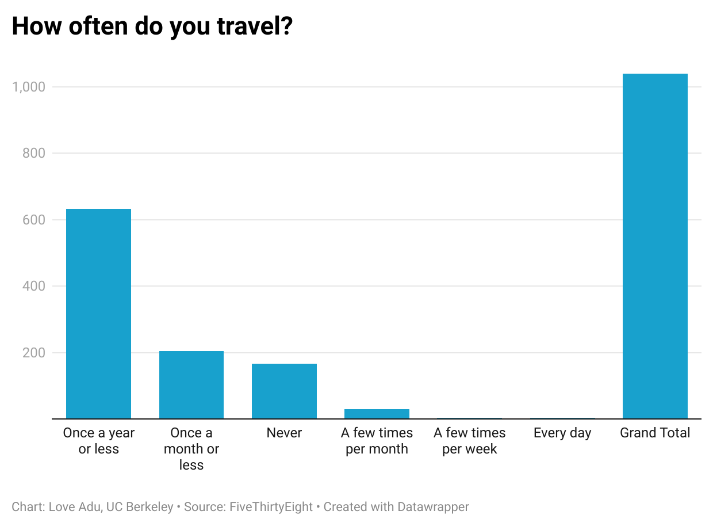

# quiz4
I personally chose the 'How often do you fly' data point because of what I could use to display the results with. I used a bar chart to show the difference in quantity in how often people fly, which is what I wanted to do since the other bar chart mentioned in this quiz sparked my interest. 

